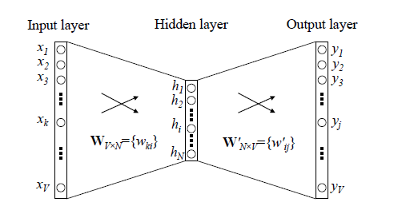
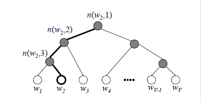

## **哈夫曼树**
哈夫曼树建立流程:

>输入：权值为$(w_1,w_2,...,w_n)$的n个节点  
>树建立流程:  
>1).将每个节点视为一棵树的根节点  
>2).将权值最小的两棵树合并，这两棵树作为新树的左右子树，新树的根节点权重为左右子树的根节点权重和。  
>3).将之前的两棵树删除，将新树加入  
>4).重复2、3直到只剩一棵树

## **Hierarchical Softmax**
**神经网络词向量**

**分层softmax**

w2vd对传统的神经网络词向量模型做了改进:
> 1.NN词向量的输入层通过一层线性变换+激活函数映射到隐藏层，分层softmax中直接对所有输入词向量求和。   
> 2.NN词向量中，需要计算整个输出层的softmax,分层softmax中使用哈夫曼树代替了输出层，softmax概率计算只需要沿着从根节点到对应的叶子节点的路径计算概率。

**分层softmax计算**  
在分层softmax中，每个节点代表一个二元逻辑回归，规定每个节点往左走是负类，往右为正类,每个节点计算方式如下:
$$
P(+)=\sigma(x_w^T\theta)=\frac{1}{1+e^{-x_w^T\theta}} \\
~\\
P(-)=1-p(+) \\
~\\
$$

其中,$x_w$是所有输入词向量的求和，$\theta$代表需要去学习的模型参数  
在训练中，对于一个输出对于$w_2$的训练样本，期望$n(w_2,1)$的$p(-)$概率大，$n(w_2,2)$的$p(-)$概率大，$n(w_2,3)$的$p(+)$概率大  
在分层softmax中，优化目标是使训练样本达到最大似然，以上图为例，似然函数如下:
$$
\prod\limits_{i=1}^3P(n(w_i,i))=(1-\frac{1}{1+e^{-x_w^T\theta_1}})(1-\frac{1}{1+e^{-x_w^T\theta_2}})(\frac{1}{1+e^{-x_w^T\theta_3}})
$$
定义霍夫曼树某一个节点$j$的逻辑回归概率为$P(d_J^w|x_w,\theta_{j-1}^w)$,从根节点到w所在叶子节点包含的节点总数为$l_w$，其表达式为:
$$
P(d_J^w|x_w,\theta_{j-1}^w)=
\left\{ 
\begin{aligned}
\sigma(x_w^T\theta_{j-1}^w) & & d_j^w=0\\
1-\sigma(x_w^T\theta_{j-1}^w) & & d_j^w=1
\end{aligned}
\right.
$$
那么似然函数可以改写为如下形式:
$$
L=\prod \limits_{j=2}^{l_w}(\sigma(x_w^T\theta_{j-1}^w))^{1-d_j^w}(1-\sigma(x_w^T\theta_{j-1}^w))^{d_j^w}
$$
对数似然为:
$$
log(L)=log \sum \limits_{j=2}^{l_w}({1-d_j^w})(\sigma(x_w^T\theta_{j-1}^w))+{d_j^w}(1-\sigma(x_w^T\theta_{j-1}^w))
$$

对$\theta_{j-1}^w$和$x^w$的导数如下:
$$

\begin{aligned}
\frac{\partial L}{\partial \theta_j^w}&=({1-d_j^w})\frac{\sigma(x_w^T\theta_{j-1}^w)(1-(\sigma(x_w^T\theta_{j-1}^w))}{\sigma(x_w^T\theta_{j-1}^w)}+{d_j^w}\frac{\sigma(x_w^T\theta_{j-1}^w)(1-(\sigma(x_w^T\theta_{j-1}^w))}{1-\sigma(x_w^T\theta_{j-1}^w)} \\
 &=(1-d_j^w-\sigma(x_w^T\theta_{j-1}^w))x_w  \\
~\\
\frac{\partial L}{\partial x^w}&=\sum\limits_2^{l_w}(1-d_j^w-\sigma(x_w^T\theta_{j-1}^w))\theta_{j-1}^w

\end{aligned}

$$

**在分层softmax中，计算一个路径上的最大似然时，只需要计算每个非叶子节点的概率，当走到最后的叶子节点时，不需要再向下走，所以无需计算叶子节点的逻辑回归概率，故而叶子节点没有参数。在路径上似然计算只需要计算非叶子节点**   

## **负采样模型**

**源码464-494**

### **Ref**
- [w2v源码](https://github.com/tmikolov/word2vec/blob/master/word2vec.c)
