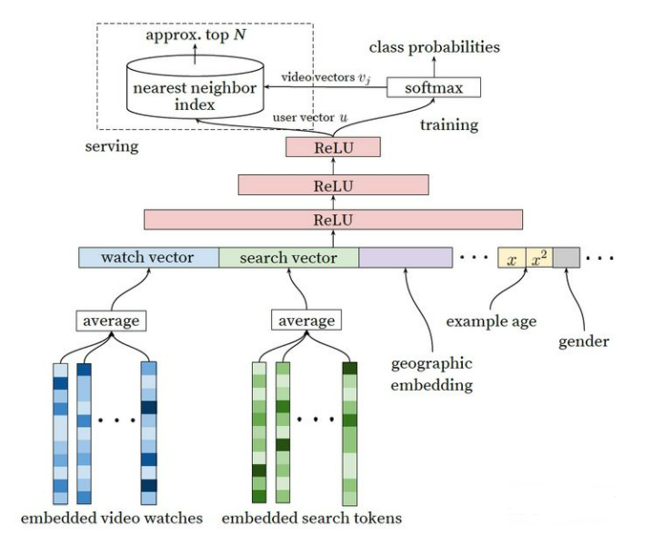

网络结构

1. online serving为什么不直接使用网络进行预测,而是使用ann近邻检索的方法
2. 模型中一个类目代表一个商品，则存在百万、千万乃至亿级别的分类,必然会影响训练速度和效果，应该如何解决
3. youtube用户对新视频有偏好，如果在模型构建过程中映入这个特征
4. 在训练集的预处理过程中，youtube没有采用原始的用户日志，而是对每个用户提取等量的训练样本，原因是什么
5. youtube为什么不采用类似rnn的序列模型，而是抛弃了用户观看历史的时序，把用户最近浏览的视频同等看待
6. 在处理测试集，youtube为甚不采用经典的随机留一法，而是使用最近一次观看行为作为测试集
7. (rank model)youtube为什么不适用ctr,播放率等指标作为优化目标，而是使用每次曝光预期播放时间作为优化目标

1. 线上预测时,保存的是softmax对应每个label的权重，使用ann检索和该目标一致，且速度更快。
2. 使用negtive sampling softmax
3. 引入代表视频发布时长的特征
4. 防止活跃用户带偏模型
5. 5
6. 防止数据穿越
7. 业务指标原因，如果采用ctr或者播放率，容易被骗点击类视频影响 