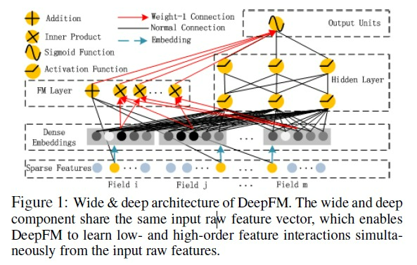

# 模型




## fm模型
$$
\hat{y}(x)=w_0+\sum\limits_{i=1}^nw_ix_i + \sum\limits_{i=1}^{n-1}\sum\limits_{j=i+1}^{n}(V_i^TV_j)x_ix_j \\
~ \\
V_i=(v_{i1},v_{i2},v_{i3},...)
$$
上式的计算复杂度为$o(kn^2)$,可将其运算复杂度降为$o(kn)$,推导如下:
$$
\sum\limits_{i=1}^{n-1}\sum\limits_{j=i+1}^{n}(V_i^TV_j)x_ix_j \\
=\frac{1}{2}(\sum\limits_{i=1}^{n}\sum\limits_{j=1}^{n}(V_i^TV_j)x_ix_j-\sum\limits_{i=1}^n(V_i^TV_j)x_ix_i) \\
=\frac{1}{2}(\sum\limits_{i=1}^{n}\sum\limits_{j=1}^{n}\sum\limits_{l=1}^k v_{il}v_{jl}x_ix_j-\sum\limits_{i=1}^n(V_i^TV_j)x_ix_i) 
$$


## deepfm模型结构


## 代码实现
```
        def my_model_fn(features, labels, mode, params):
            with tf.variable_scope("input"):
                weight = fea_numeric(features, 'sample_weight')
                self.sample_weight = tf.reshape(weight, [-1, 1])
                ###############
                # category feature process
                ###############
                #category info with hash bucket
                feature_column_category = []
                hash_size = {
                        'info_city_id': 600,
                        'user_city_id': 600,
                        'cate1': 40,
                        'cate2': 400,
                        'cate3': 4000,
                        'same_city': 3,
                        'realTimeInfoWord_infoword': 301,
                        'realTimeSearch_singleSearch': 301,
                        'realTimeAlsoViewFromSearch_realtime': 301,
                        'homeRecommend_usercf': 301,
                        ......
                        }
                hash_type = {
                        'cate2': tf.string,
                        'cate3': tf.string,
                        }
                for col in hash_size.keys():
                    if hash_type.__contains__(col):
                        feature_column_category.append(get_cate_with_hash(features, col, hash_size.get(col), hash_type.get(col)))
                    else:
                        feature_column_category.append(get_cate_with_hash(features, col, hash_size[col]))
                feature_column_category.append(get_cate_multi_hot_string(features, 'recall', 100, tf.string))

                features_split = [
                        'cate2_price_ctr', 'reco_ctr', 'search_ctr',
                        'token_cate2_price_bin_ctr', 'token_cate1_ctr1d', 'token_cate1_ctr7d',
                        'token_cate2_ctr1d', 'token_cate2_ctr7d', 'token_cate1_prop1d', 'token_cate1_prop7d',
                        'token_cate2_prop1d', 'token_cate2_prop7d', 'dwell_time_avg', 'dwell_time_med',
                        'dwell_time_var', 'cate_ratio', 'terminal_itemword_price_ctr', 'brand_itemword_ctr',
                        'tag_sim_click1', 'tag_sim_click10', 'word_sim_click1',
                        'word_sim_click10', 'avgprice_ratio', 'info_ctr', 'itemword_ctr', 'brand_ctr'
                        ]
                for col in features_split:
                    feature_column_category.append(get_idx_column_split(features, col))

                field_size_cate = feature_column_category.__len__()
               
                ###############
                # continuous feature process
                ###############
                numeric_columns = ['cate2_price_ctr', 'reco_ctr', 'search_ctr',
                                   'token_cate2_price_bin_ctr', 'token_cate1_ctr1d', 'token_cate1_ctr7d',
                                   'token_cate2_ctr1d', 'token_cate2_ctr7d', 'token_cate1_prop1d', 'token_cate1_prop7d',
                                   'token_cate2_prop1d', 'token_cate2_prop7d', 'dwell_time_avg', 'dwell_time_med',
                                   'dwell_time_var', 'cate_ratio', 'terminal_itemword_price_ctr', 'brand_itemword_ctr', 
                                   'tag_sim_click1', 'tag_sim_click10', 'pics_eb8_1', 'pics_eb8_2', 'pics_eb8_3','pics_eb8_4',
                                   'pics_eb8_5', 'pics_eb8_6', 'pics_eb8_7', 'pics_eb8_8', 'word_sim_click1',
                                   'word_sim_click10', 'info_ctr', 'itemword_ctr', 'brand_ctr',
                                   'interest_weight_cate1_3m', 'interest_weight_cate2_3m', 'interest_weight_cate1_1w', 'interest_weight_cate2_1w'
                                   ]
                #########
                numeric_maxval = {
                        'dwell_time_avg': 140,
                        'dwell_time_med': 140,
                        'dwell_time_var': 1400
                        #'avgprice_ratio': 1000
                        }
                #cate2_price_margin = fea_numeric(features, 'cate2_price_margin')
                feature_column_cont = []
                for col in numeric_columns:
                    if numeric_maxval.__contains__(col):
                        feature_column_cont.append(fea_numeric(features, col, 0, numeric_maxval.get(col)))
                    else:
                        feature_column_cont.append(fea_numeric(features, col))
                feature_column_cont.append(tf.multiply(tf.math.log(tf.add(fea_numeric(features, 'avgprice_ratio'), tf.constant(1.02))), 0.1))
                field_size_cont = feature_column_cont.__len__()
                fea_values_cont = tf.reshape(tf.concat(feature_column_cont, axis=1), [-1, field_size_cont])
                fea_ids_cont = tf.range(field_size_cont, dtype=tf.int32)
                hidden_units = self.deep_layers
                field_size = field_size_cate + field_size_cont
            if mode == tf.estimator.ModeKeys.PREDICT:
                self.label = tf.ones_like(tf.reshape(features['cate1'], shape=[-1, 1]), dtype=tf.float32)
            else:
                self.label = tf.reshape(tf.cast(labels, tf.float32), shape=[-1, 1], name='label')

            #FM_B = tf.get_variable(name='fm_bias', shape=[1], initializer=tf.constant_initializer(0.0))
            #fm_w = tf.get_variable(name='fm_w', shape=[self.feature_sizes], initializer=tf.glorot_normal_initializer())
            # fm辅助向量
            fm_v = tf.get_variable(name='fm_v', shape=[field_size_cont, self.embedding_size + 1],
                                   initializer=tf.glorot_normal_initializer()
                                   )

            with tf.variable_scope("embedding"):
                embeddings = tf.nn.embedding_lookup(fm_v, fea_ids_cont)
                fea_values2 = tf.reshape(fea_values_cont, shape=[-1, field_size_cont, 1])
                embeddings = tf.multiply(embeddings, fea_values2)
                embeddings = tf.concat([tf.concat(feature_column_category, axis=1), embeddings], axis=1)
                #emb = tf.concat([embeddings[:, :, 1:], tf.reshape(tf.concat(feature_column_emb, axis=1), shape=[-1, 4, 8])], axis=1)
                #field_size = field_size + 4
                emb = embeddings[:, :, 1:]
            
            with tf.variable_scope("fm"):
                with tf.variable_scope("fm_first_order"):
                    #weights = tf.nn.embedding_lookup(fm_w, fea_ids)
                    y_first_order = embeddings[:, : , 0]
                    #y_first_order = tf.multiply(weights, fea_values)

                with tf.variable_scope("fm_second_order"):
                    sum_square = tf.square(tf.reduce_sum(embeddings[:, :, 1:], 1))
                    square_sum = tf.reduce_sum(tf.square(embeddings[:, :, 1:]), 1)
                    y_second_order = 0.5 * tf.subtract(sum_square, square_sum)
                y_fm = tf.concat([y_first_order, y_second_order], axis=1)
                #y_fm = tf.nn.dropout(y_fm, keep_prob=1.0-self.dropout)
                # deep component

            with tf.variable_scope("deep"):
                y_deep = tf.reshape(embeddings[:, :, 1:], shape=[-1, field_size * self.embedding_size])
                #y_deep = tf.nn.dropout(y_deep, keep_prob=1.0-self.dropout)
                for i in range(len(hidden_units)):
                    y_deep = tf.layers.dense(y_deep, hidden_units[i],
                                             kernel_initializer=tf.contrib.layers.xavier_initializer(),
                                             kernel_regularizer=tf.contrib.layers.l2_regularizer(self.l2_reg_rate),
                                             name="dnn_layer_%d" % i
                                             )
                    tf.summary.histogram('hidden_out' + str(i), tf.get_default_graph().get_tensor_by_name(
                        os.path.split(y_deep.name)[0] + '/kernel:0'))
                    #y_deep = tf.layers.batch_normalization(y_deep,training=mode==tf.estimator.ModeKeys.TRAIN)
                    y_deep = tf.nn.relu(y_deep)
                    if mode == tf.estimator.ModeKeys.TRAIN:
                        y_deep = tf.nn.dropout(y_deep, keep_prob=1.0 - self.dropout)

            # combine component
            out = None
            with tf.variable_scope("combine"):
                concat_input = tf.concat([y_fm, y_deep], axis=1)
                out = tf.contrib.layers.fully_connected(concat_input, 1,
                                                        weights_initializer=tf.contrib.layers.xavier_initializer(),
                                                        activation_fn=tf.identity,
                                                        biases_initializer=tf.constant_initializer(0),
                                                        weights_regularizer=tf.contrib.layers.l2_regularizer(self.l2_reg_rate),
                                                        scope="combine")
            pred = tf.nn.sigmoid(out, name="probability")
            predictions = {"prob": pred}
            log_loss = tf.losses.log_loss(self.label, pred, weights=self.sample_weight, reduction="weighted_mean")
            #l2_loss_1 = l2_reg * tf.nn.l2_loss(fm_w)
            #l2_loss_2 = l2_reg * tf.nn.l2_loss(fm_v)

            #l2_loss = l2_loss_1 + l2_loss_2
            #l2_loss = l2_reg * tf.reduce_mean(tf.reduce_sum(tf.reduce_sum(tf.square(embeddings), 2), 1), 0)
            l2_loss = tf.losses.get_regularization_loss()
            self.loss = log_loss + l2_loss
            tf.summary.histogram('fm_v', fm_v)
            #tf.summary.histogram('fm_w', fm_w)
            #tf.summary.scalar("l2_loss_1", l2_loss_1/l2_reg)
            #tf.summary.scalar("l2_loss_2", l2_loss_2/l2_reg)

            opt = tf.train.GradientDescentOptimizer(self.learning_rate)
            if self.optimizer_type == "adam":
                self.optimizer = tf.train.AdamOptimizer(learning_rate=self.learning_rate, beta1=0.9, beta2=0.999,
                                                        epsilon=1e-8).minimize(self.loss,
                                                                               global_step=tf.train.get_global_step())
            elif self.optimizer_type == "adagrad":
                self.optimizer = tf.train.AdagradOptimizer(learning_rate=self.learning_rate,
                                                           initial_accumulator_value=1e-8).minimize(self.loss)
            elif self.optimizer_type == "gd":
                self.optimizer = tf.train.GradientDescentOptimizer(learning_rate=self.learning_rate).minimize(self.loss)
            elif self.optimizer_type == "momentum":
                self.optimizer = tf.train.MomentumOptimizer(learning_rate=self.learning_rate, momentum=0.95).minimize(
                    self.loss)

            loss_summary = tf.summary.scalar('loss', self.loss)
            regularization = tf.summary.scalar('regularization', l2_loss)
            log_loss_summary = tf.summary.scalar('log_loss', log_loss)
            self.merged = tf.summary.merge([loss_summary, log_loss_summary, regularization])
            #pdb.set_trace()
            # ============= predict spec
            if mode == tf.estimator.ModeKeys.PREDICT:
                return tf.estimator.EstimatorSpec(
                    mode=mode,
                    predictions={'probabilities': pred, 'out': out, 
                        'cate1':features['cate1'], 'emb_cate1': embeddings[:, 2, 1:], 
                        'cate2':features['cate2'], 'emb_cate2': embeddings[:, 3, 1:], 
                        'cate3':features['cate3'], 'emb_cate3': embeddings[:, 4, 1:]})
            # ============= evaluate spec
            # STUPID TENSORFLOW CANNOT AUTO-CAST THE LABELS FOR ME

            eval_metric_ops = {'auc': tf.metrics.auc(self.label, pred)}
            if mode == tf.estimator.ModeKeys.EVAL:
                return tf.estimator.EstimatorSpec(mode=mode,
                                                  loss=self.loss,
                                                  eval_metric_ops=eval_metric_ops)
            # ============= train spec
            assert mode == tf.estimator.ModeKeys.TRAIN
            return tf.estimator.EstimatorSpec(mode,
                                              loss=self.loss,
                                              predictions=pred,
                                              train_op=self.optimizer,
                                              eval_metric_ops=eval_metric_ops)

```