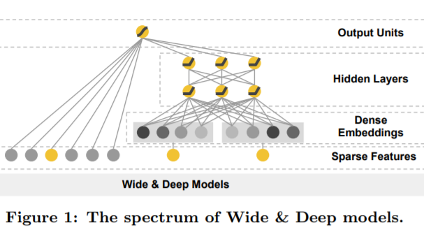

论文:https://arxiv.org/pdf/1606.07792.pdf

# 模型
## 模型结构

**wide部分**  

cross product transformation:
$$
\phi_k(x)=\prod\limits_{i=1}^{d}x_i^{c_{ki}}
$$

**deep部分**
$$
\alpha^{l+1}=f(W^{(l)}a^{(l)}+b^{(l)})
$$
在wd中,f为relu激活函数，l代表层编号。

**联合训练**  
在联合训练模式下输出为:
$$
P(Y=1|x)=\sigma(W_{wide}^T[X,\phi(x)]+W_{deep}^T\alpha^{l_f}+b)
$$

# 一些问题
## widedeep怎么确定哪些特征放在wide哪些特征放在deep
wide&deep原论文中表述为：wide侧用于记忆适合输入组合特征，deep侧用于泛化，适合输入非组合特征。  
但是从一些实际实验以及别人的一些工作上来看，把组合特征放到deep侧也能有效提升模型auc。   
在模型结构的角度来说,deep侧相比于wide侧参数更多,层数更深，应该相对于wide侧泛化更强且记忆更强。  
个人理解wide侧相对于deep优势在于参数量少，容易拟合，更擅长记住长尾用户的行为。

## widedeep为什么要对连续特征离散化
deep侧nn模型可以离散化也可以不离散化
wide侧的离散化可以等同于lr模型的离散化,一般原因包括:
1. 稀疏向量运算速度快
2. 离散化后相近的值会分在同一个桶中(在划分点附近的点则可能受到影响)
3. 分桶对异常数据更鲁棒
4. 连续特征的一个权重变成了多个特征多个权重，提高了非线性和vc维

## wide侧为什么使用l1 ftrl训练

## widedeep 怎么分别计算l1 ftrl 和adagrad
