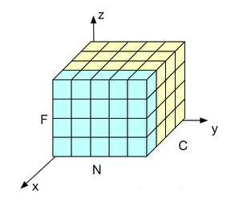
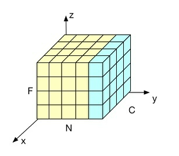

## BatchNorm
### **BN计算方法**
$$
\text{Input:B}=\{x_{1...m}\};
\gamma,\beta\text{(parameters to be learned)} \\
~\\
\text{Output:}\{y_i=BN_{\gamma\beta(x_i)}\} \\
~\\
\mu_j \leftarrow \frac{1}{m} \sum \limits_{i=1}^m x^i_j \\
~\\
\alpha_j^2 \leftarrow \frac{1}{m} \sum\limits\limits_{i=1}^m(x^i_j-\mu_j)^2 \\
~\\
\tilde{x_j} \leftarrow \frac{x_j-\mu_j}{\sqrt{\alpha_j^2+\epsilon}} \\
~\\
y_i \leftarrow \gamma_j \tilde{x_j} + \beta_j \\
~\\
\gamma,\beta\text{是可训练参数}
$$
m代表一个batch的样本数量，在mlp中，j代表第j个神经元；在cnn中j代表第j个通道。
### **bn归一化维度**
cnn中bn结构如下,其中F代表特征，在cnn中f代表图片长乘宽，n代表batch长度，c代表通道数。

### **实际使用时的$\mu$、$\alpha$计算**
**1. 用训练集的均值方差做测试集均值方差的无偏估计**
$$
\mu_{test}=E(\mu_{batch}) \\
~\\
\alpha_{test}^2 = \frac{m}{m-1}E(\alpha^2_{batch}) \\
~\\
BN(X_{test})=\gamma \frac{X_{test}-\mu_{test}}{\sqrt{\alpha^2_{test}+\epsilon}}+\beta \\
~\\
\text{其中m代表batch的大小}
$$

**2. 移动平均法**
$$
\bar{\mu} \leftarrow p\bar{\mu}+(1-p)\mu^t \\
~\\
\bar{\alpha^2} \leftarrow p\bar{\alpha^2}+(1-p){\alpha^2}^t
$$
预测时，直接使用$\bar{\mu}$和$\bar{\alpha^2}$

### **bn存在的问题**
**1. batch size**
bn按照样本数计算归一化统计量，当样本很少时，计算的统计量无法代表全局的统计信息。

**2. bn与rnn**  
在rnn中，bn是作用在每个时间步上对内部的mlp上  
一个batch内句子的长度可能不一致，在靠后的时间步上，可能只有一两个样本还有数据，基于这些少数样本得到的统计量无法反映全局分布。
且测试集中可能存在长度大于训练集的样本，对于这些样本，无法找到保存的对应时间步的统计量。

**3.bn的位置问题**  
bn论文中将bn放在激活函数前，这样bn无法控制在进入下一层之前的分布，将bn放在激活函数之后就不会有这个问题。
2.bn的正则化作用:

**4.bn的正则化作用**  
在BN层中，每个batch计算得到的均值和标准差是对于全局均值和标准差的近似估计，这为我们最优解的搜索引入了随机性，从而起到了正则化的作用。

**5.norm方法可以加速收敛**

## **LayerNorm**
$$
\mu^l=\frac{1}{H}\sum\limits^H_{i=1}x^l_i \\
~\\
\alpha^l=\sqrt{\frac{1}{H}\sum\limits^H_{i=1}(x^l_i-\mu_l)}
~\\
LN(x^l)=g \frac{x^l-\mu^l}{\sqrt{(\alpha^l)^2+\epsilon}}+b \\

$$
其中l代表当前的层数，h代表当前层的隐藏节点数。

### **rnn中的ln**
对于第t个时间步,ln的计算方法如下:

## 其他的Norm方法
1. WeightNorm
2. InstanceNorm
3. GroupNorm
4. PositionalNorm
5. ConditionalBatchNorm