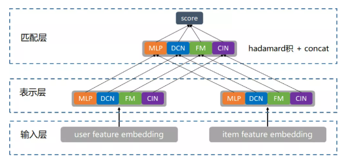
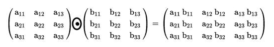
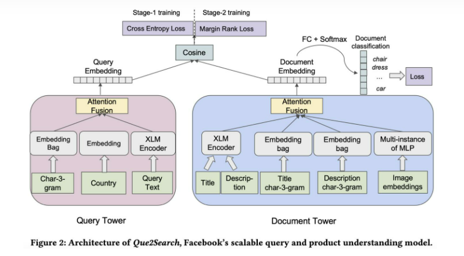
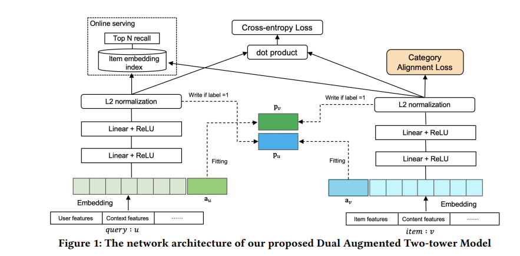

# 为什么需要粗排
> 在召回数量大的情况下:  
> 1. 全部进入精排,耗时无法负担。
> 2. 截断召回源,会导致被截断的召回源弱者恒弱,且当增加一路新的召回源时,可能会改变原有召回源顺序，导致系统不稳定。   
>
> 增加粗排的优势:  
> 1. 减小精排模型的输入量，为精排模型复杂度提升拉出空间
> 2. 召回模块传入下一个模块的输出量可以变得更多

 

# 双塔模型

> - item侧离线更新
> - user侧可以实时
> 线上逐一点积
> 倒排截断后喂给精排

# 双塔的问题
1. **两侧特征计算相似度前高度"浓缩",可能损失信息**
2. **两侧特征只在最后计算相似度时发生交互。**
3. 交叉特征没有合适的位置加入
4. 考虑到时效，只能计算点积or余弦
5. 离线更新embedding可能不及时,可能无法满足用户/物料变化较快场景的需要。

优化方法:  
    1. 特征工程  
    2. 特征选择  
    3. 蒸馏精排模型  
    4. embedding更新  

 

# 优化思路

## 1.SEBlock(特征重要性)  
既然单个塔会导致信息压缩，损失信息量，那就加大重要特征的权重

**squeeze**  
$z_i=F_sq(v_i)=\frac{1}{k}\sum\limits_{t=1}^k v_i^t$  

**excitation**  
$S=F_{ex}(Z,W)=\sigma(W_2\sigma(W_1Z))$

> SENET:seblock+双塔   
> COLD: seblock特征选择+去双塔
 

## 2.多路双塔 
- 提高单侧塔表达能力
- 单侧的信息可以沿不同的路径向上，从而缓解信息的压缩(不同的信息沿不同的通道)
- 耗时增大(并行情况下影响不大)

表示层:两侧对应的相同模块做hardmard积(哈达玛积)+concat

匹配层:LR

### ***多塔embedding融合***

## 3.特征交互  

《A Dual Augmented Two-tower Model for Online Large-scale Recommendation》   KDD21   

>$
\text{用户侧输入:}z_u = [e_{i}][e_{sh}][e_{male}][...][a_u]   
$
>
>$
\text{item侧输入:}z_v= [e_{j}][e_{p_{10}}][e_{cate}][...][a_v]
$  
$a_u$、$a_v$通过itemid、userid查表得到，代表另一侧塔与该item、user交互过的所有user、item的信息。  

**Adaptive Mimic Mechanism**
只在y=1时发挥作用，目标是让$a_u$与所有和当前item、user正向交互过的item的输出embedding $p_v$尽可能相似，$a_v$类似。
$$
loss_u = \frac{1}{T} \sum \limits_{(u,v,y) \in \Tau} [ya_u+(1-y)p_v-p_v]^2
$$
$$
loss_v = \frac{1}{T} \sum \limits_{(u,v,y) \in \Tau} [ya_v+(1-y)p_u-p_u]^2
$$
$$
loss_v = loss_p + \lambda_1 loss_u + \lambda_2loss_v+\lambda_3 loss_{CA}
$$

$\Tau$:训练集

随机负采样
 

# 样本选择

    1. 曝光未点击样本  
    2. 全局随机选择负例  
    3. Batch内随机选择负例  
    4. 曝光样本内随机选择负例  
    5. 基于流行度选择负例  

$$
CVR_{model_i}=\frac{\sum\limits_{range=1}^{10} order_{couponratio_j}/order percennt_j}{eval_{model_i}}

$$