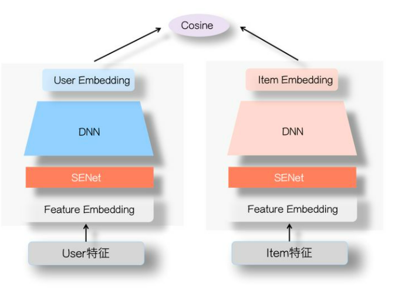

# 为什么需要粗排
> 在召回数量大的情况下:  
> 1. 全部进入精排,耗时无法负担。
> 2. 截断召回源,会导致被截断的召回源弱者恒弱,且当增加一路新的召回源时,可能会改变原有召回源顺序，导致系统不稳定。   
>
> 增加粗排的优势:  
> 1.减小精排模型的输入量，为精排模型复杂度提升拉出空间
> 2.召回模块传入下一个模块的输出量可以变得更多

 

# 双塔模型

> - item侧离线更新
> - user侧可以实时
> 线上逐一点积
> 倒排截断后喂给精排

# 双塔的问题
1. 离线更新embedding可能不及时,可能无法满足用户/物料变化较快场景的需要。  
2. 两侧特征只在最后计算相似度时发生交互。
3. 两侧特征计算相似度前高度"浓缩",可能损失信息
4. 交叉特征没有合适的位置加入
5. 考虑到时效，只能计算点积or余弦

优化方法:  
    1. 特征工程  
    2. 特征选择  
    3. 蒸馏精排模型  
    4. embedding更新  

 

# 优化思路

1. SENET  

**squeeze**  
$z_i=F_sq(v_i)=\frac{1}{k}\sum\limits_{t=1}^k v_i^t$  

**excitation**  
$S=F_{ex}(Z,W)=\sigma(W_2\sigma(W_1Z))$

> COLD  
> seblock 特征选择+工程优化

2. 多路双塔

 

# 样本选择
现有的样本选择策略  
    1. 曝光未点击样本  
    2. 全局随机选择负例  
    3. Batch内随机选择负例  
    4. 曝光样本内随机选择负例  
    5. 基于流行度选择负例  